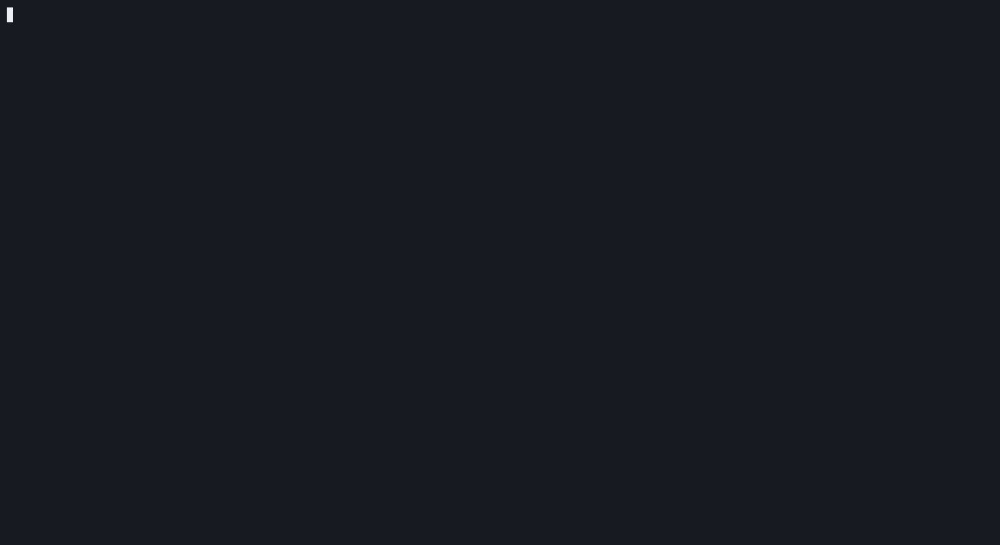

# Blocks

A Sokoban terminal game made with [Ratatui].



## Install

Requires [Nerd Fonts].

Install [Rust], then:

```sh
cargo install --git https://github.com/LiamDavey/blocks
```

[Ratatui]: https://ratatui.rs
[Nerd Fonts]: https://www.nerdfonts.com/
[Rust]: https://rustup.rs/

## Play

```sh
blocks
```

| Key              | Action                                          |
| ---------------- | ----------------------------------------------- |
| `Left` / `h`     | Move left.                                      |
| `Right` / `l`    | Move right.                                     |
| `Down` / `j`     | Move down.                                      |
| `Up` / `k`       | Move up.                                        |
| `r`              | Restart level.                                  |
| `q`              | Quit.                                           |

## License

Copyright (c) leelemon <104245487+LiamDavey@users.noreply.github.com>

This project is licensed under the MIT license ([LICENSE] or <http://opensource.org/licenses/MIT>)

[LICENSE]: ./LICENSE
